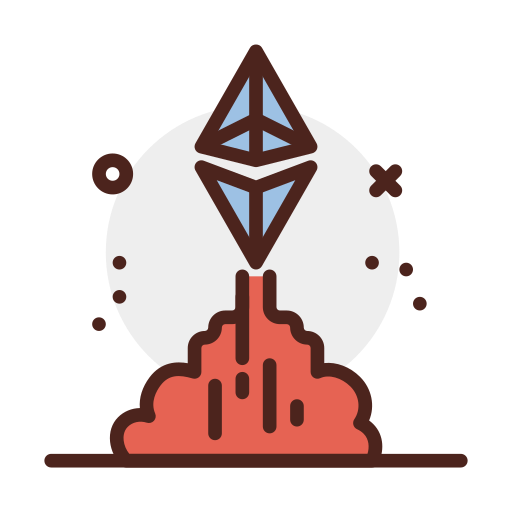

# Web3CryptoDev

<html>

<h2>🚀 Learn Web3 development from Zero to Mastery.</h2>

<div style="clear: both;">
  <div style="float: left; margin-right 1em;">
  
  </div>
  <div>
    <p>🎯 **Our goal:** Create a running series of guides covering Solidity and all things Web3 development aimed at developers.</p>
    <p>As a result of this, we will connect devs to devs and build a community around building, innovation and mutual help.</p>
  </div>
</div>
</html>

<!-- 🚀 Learn Web3 development from Zero to Mastery.

🎯 **Our goal:** Create a running series of guides covering Solidity and all things Web3 development aimed at developers.

As a result of this, we will connect devs to devs and build a community around building, innovation and mutual help. -->

See the website: \
[Web3cryptodev.com](https://www.web3cryptodev.com/)

Join our Discord: \
[Web3cryptodev Discord](https://discord.gg/PqVhBKxSKb)


## 🖖 Our mission

**Easy to use**  
Designed with open source contributions from people like you! Our community aims to teach developers how to quickly learn and apply web3 development skills.

**Focus on What Matters**  
Focus on what matters. Explore what real web3 developers do day to day. Go beyond "Hello World" tutorials. Go deeper and explore the depths of web3. We combine theory with real-world examples.

**Powered by the Commmunity**  
Leverage our collective knowledge. Strive to make one small contribution. The sum is greater than the whole!

**Ship, ship, ship**  
Don't let the perfect be the enemy of the good. Shipping and improving via iterations is preferable to analysis paralysis.

## 🛠 Start Building

New to building in Web3?

See our beginner-friendly tutorials below:

[🛠 Solidity 101](https://www.web3cryptodev.com/docs/solidity-101/course-introduction/introduction-course)

For completely new developers check out some our resources to provide the basics:

[Learn Web Development Fast](https://www.web3cryptodev.com/docs/solidity-101/course-introduction/course-prerequisites)

## 🧭 The Approach

Web3 changes fast. So, our content will be considered living documents that are intended to keep up with these changes. We will move fast and break things.

Our writing approach will be:

1. Write and published quickly, aiming for every weekday.
2. Solicit community feedback through [issues](https://github.com/tesla809/BuildersETH) and [pull requests](https://github.com/tesla809/BuildersETH/pulls) for fixes, content suggestions, and content additions.
3. Progressively expand the topics over time.

The work is **NOT** perfect. Most of it needs heavy proofreading and will be edited over time.

**The process will be:**  
Build -> Write -> Publish -> Edit in public

Our learning process will be similar to [the Feynman Method](https://blog.doist.com/feynman-technique/):  
Play -> Learn -> Teach

## 🤝 Contributors Welcomed

Have a topic you’d like to contribute or want to learn about? Feel free to open an [issue](https://github.com/tesla809/BuildersETH/issues).

Want to submit to the blog, lesson, lesson fix, or image/logo?

Submit a [pull requests](https://github.com/tesla809/BuildersETH/pulls).

Any and all feedback is appreciated <3!

## 📄 Local Setup Instructions

This website is built using [Docusaurus 2](https://docusaurus.io/), a modern static website generator.

### Installation

```
$ yarn
```

### Local Development

```
$ yarn start
```

This command starts a local development server and opens up a browser window. Most changes are reflected live without having to restart the server.

### Build

```
$ yarn build
```

This command generates static content into the `build` directory and can be served using any static contents hosting service.

### Deployment

This project deploys on [Vercel](https://vercel.com/guides/deploying-docusaurus-with-vercel).
